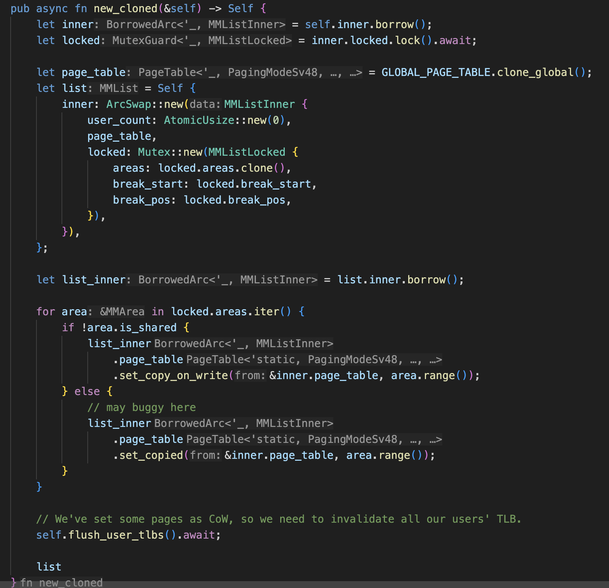
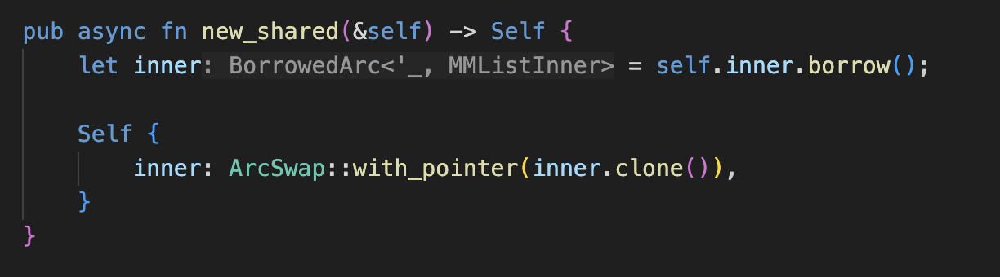

# 现场赛

## git支持

- 在现场赛的前一天，尝试运行git，一直会报错stack smashing(ltp之前也有这个问题)，最后发现是内核中的 struct termios 是之前写的比较老的版本，一个字段是32字节，glibc规定的是19字节，因此syscall时发生写缓冲区溢出，stack guard的检查失败。

- git init 会有多次以下操作：```mv .config.lock .config```，其中两个文件均已存在，因此 rename 操作要先删除目标文件的数据，再将目标文件覆盖为源文件的内容，使用的 ext4 文件系统的 crate 有一些问题，修改了一下又跟内核的 vfs 适配了一下。
- git commit 和 git log 在解决以上问题后即运行成功
- git clone 需要使用 ssh 协议或者 https 协议，我们对这两个都进行了很多尝试，最后由于时间关系没有成功

## vim

- 添加了一些 syscall 的实现之后 ```vim -h``` 运行成功
- vim 编辑文件正常
- vim 保存并退出时，会调用一个 sigtimewait 的syscall，用来让一个线程等待一个信号的产生，我们现在的信号有一点问题，所以添加了一个临时的实现。

## gcc

- 添加了一些 syscall 的实现之后 ```vim -h``` 运行成功
- gcc的编译需要多线程的支持，Enoix原先的多线程支持还存在两个重大缺陷，一个是clone相关的父线程和子线程使用了和传统fork多进程的生命周期管理，具体表现为当父进程退出时，tid=pid时，所有clone出来的线程都会exit，但这并不符合多线程的语义，我们修改了进程/线程推出时的判断逻辑，改成了判断当其为最后一个线程时再把进程释放掉；另一个是进程地址空间原先并不支持 copy 和 shared 两种语义，我们将mmlist（Enoix 进程地址空间对象）在每个task中存储为ArcSwap智能指针，高效实现进程地址空间fork和clone的语义, 同时保证了并发安全。




## rustc

- 添加了一些 syscall 的实现之后 ```rustc -h``` 运行成功
- rustc 编译会出现内存的 fault，由于时间关系没有解决

## 上板

上述修改结束后时间已经不够了，没有时间做板子的适配了
